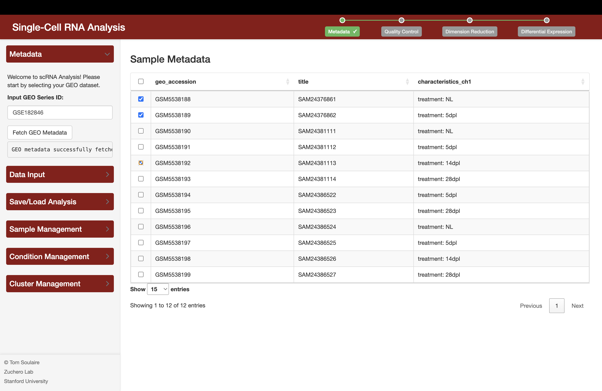
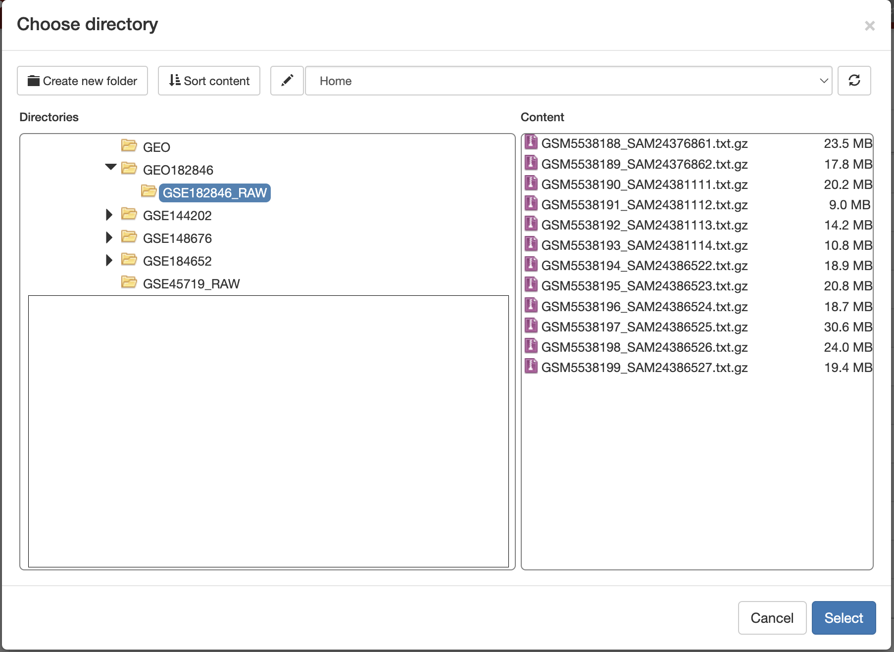
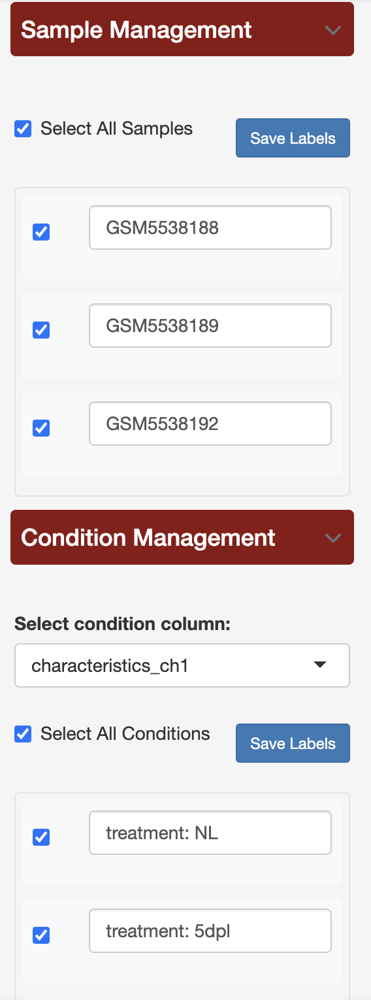
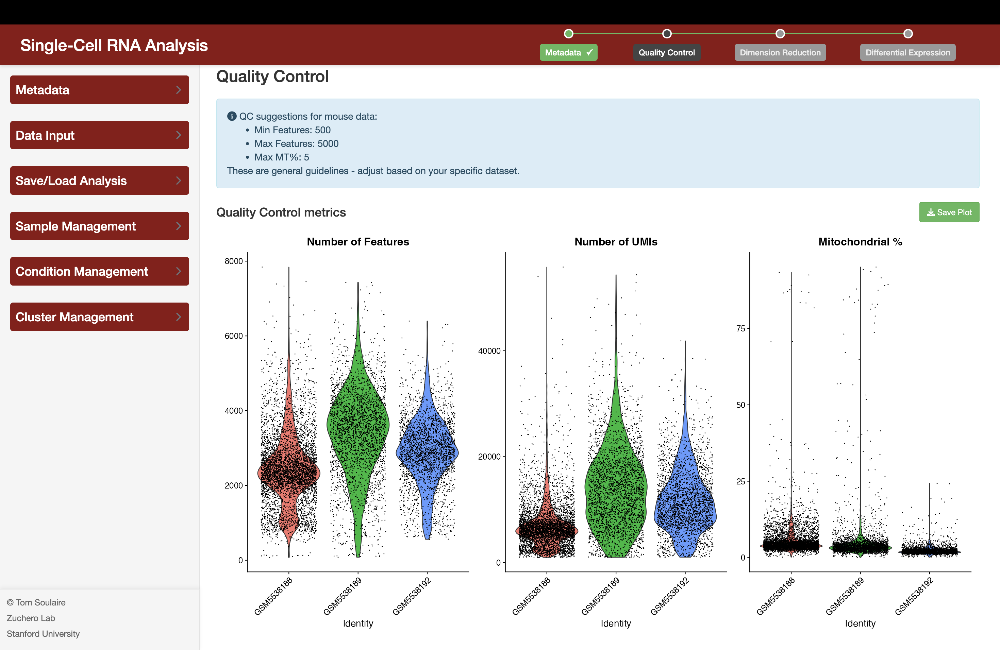
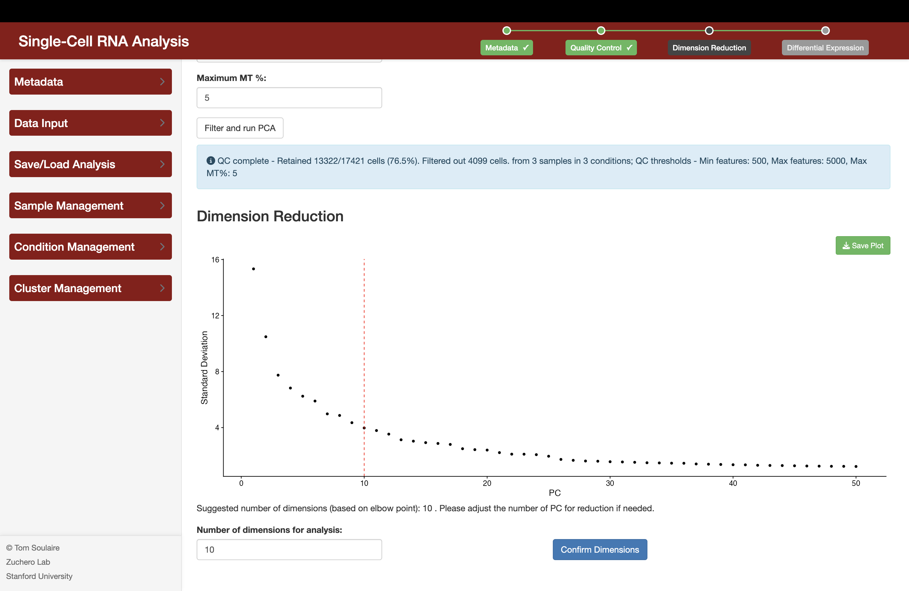
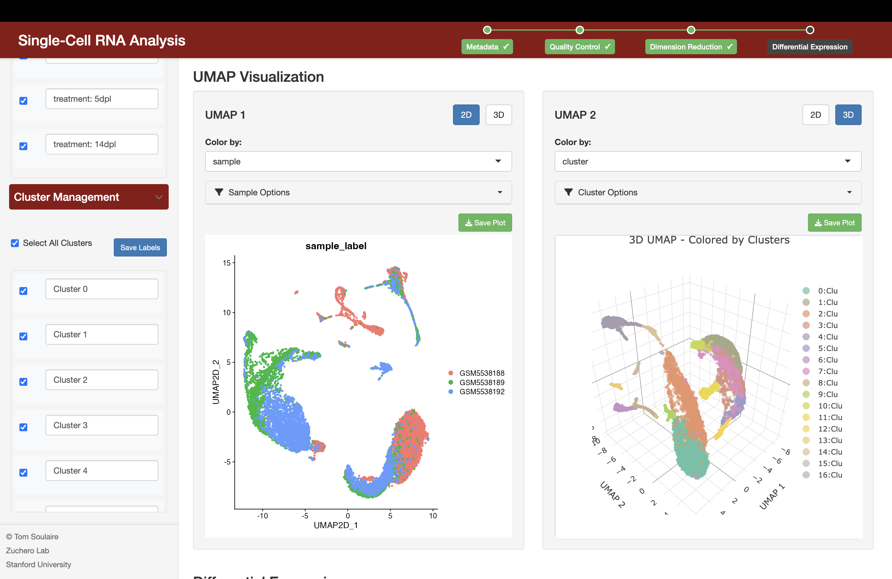
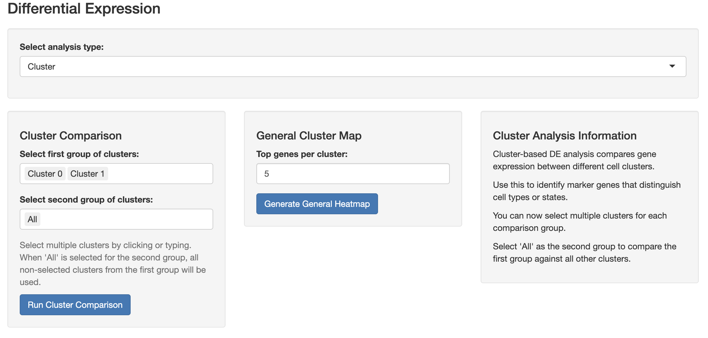
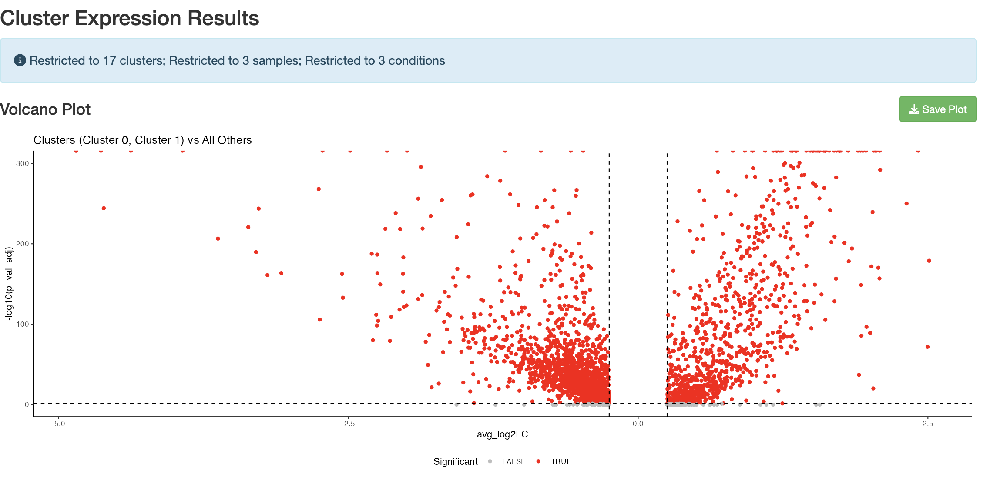
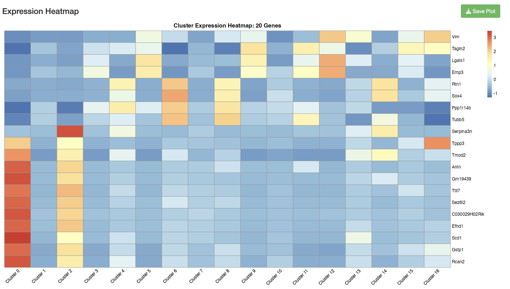
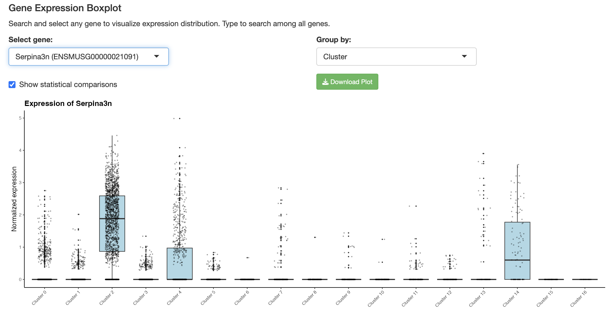

# shinyscRNA: Single-Cell RNA Analysis Tool 

A comprehensive Shiny application for analyzing single-cell RNA sequencing data with an intuitive modular workflow. shinyscRNA provides a streamlined interface for scRNA-seq analysis with support for both web and desktop usage through Electron.

## Table of Contents
- [Installation](#installation)
  - [Web Application](#web-application)
  - [Desktop Application](#desktop-application)
- [User Guide](#user-guide)
  - [Metadata Import](#metadata-import)
  - [Data Input](#data-input)
  - [Quality Control](#quality-control)
  - [Dimension Reduction](#dimension-reduction)
  - [Cluster Management](#cluster-management)
  - [Sample & Condition Management](#sample--condition-management)
  - [Differential Expression](#differential-expression)
  - [Saving and Loading](#saving-and-loading)
- [Code Architecture](#code-architecture)
  - [App Structure](#app-structure)
  - [Module System](#module-system)
  - [Desktop Integration](#desktop-integration)
  - [Code Documentation](#code-documentation)

## Installation

### Prerequisites
- R (version 4.0.0 or higher)
- RStudio (recommended for development)
- Internet connection (for fetching GEO data)

### Web Application

1. Clone the repository:
```bash
git clone https://github.com/toslr/scRNA-shinyApp.git
cd scRNA-shinyApp
```

2. Install required R packages:
```r
source("install.R")
```

This will install all dependencies required by the application, including:
- shiny
- Seurat
- patchwork
- shinyjs
- shinyFiles
- dplyr
- Matrix
- ggplot2
- scCustomize
- DT
- GEOquery
- pheatmap
- plotly
- htmlwidgets
- RColorBrewer
- fontawesome
- ggpubr
- hdf5r

3. Launch the web application:
```r
shiny::runApp()
```

### Desktop Application

The application can also be run as a desktop application using Electron:

1. For MacOS: Download the app file: shinyscRNA-1.0.0-arm64.dmg

2. Put it in your Applications folder and click to run it.

3. It might be necessary to allow the app to access full disk in your computer 
security settings.


## User Guide

The shinyscRNA app provides a step-by-step workflow for analyzing single-cell RNA sequencing data. Follow these steps to complete your analysis:

### Metadata Import

1. **GEO Series Input**:
   - Enter a GEO Series ID (e.g., "GSE123456") in the input field.
   - Click "Fetch GEO Metadata".
   - The application will load sample metadata from the Gene Expression Omnibus.
   - After loading, you'll see a table showing all samples in the dataset.
   - Use the checkboxes to select which samples to include in your analysis.



### Data Input

1. **Data Selection**:
   - After selecting samples from the metadata step, click "Select Data Directory".
   - Navigate to the folder containing your expression data files.
   - Choose a species or use auto-detection for gene mapping.
   - The app supports multiple file formats: .txt.gz, .h5, and 10X MTX formats.
   - Click "Read Data" to import the expression matrices into the application.
   


### Sample & Condition Management

From now on, you can use the sample and condition management panels in the 
sidebar.

- **Sample Management**:
  - Activate/deactivate samples for targeted analysis. The modules take into 
  account which samples are active before running.
  - Customize sample labels. Don't forget to press Save Labels.
  - Filter visualizations to focus on specific samples.

- **Condition Management**:
  - Activate/deactivate conditions for targeted analysis. The modules take into 
  account which conditions are active before running.
  - Customize condition labels. Don't forget to press Save Labels.
  - Filter visualizations to focus on specific samples.
  
  

### Quality Control

1. **QC Metrics Inspection**:
   - After data input, the QC section will display violin plots showing:
     - Number of features (genes) per cell
     - Number of UMI counts per cell
     - Percentage of mitochondrial reads
   - Species-specific QC suggestions will be displayed when available.

   

2. **Filter Parameters**:
   - Adjust these parameters based on your QC plots:
     - Minimum Features: Cells with fewer features than this will be filtered out.
     - Maximum Features: Cells with more features than this will be filtered out (removes potential doublets).
     - Maximum MT %: Cells with higher mitochondrial percentage will be filtered out (typically dying cells).
   - Click "Filter and run PCA" to apply these filters and normalize the data.
   
   

### Dimension Reduction

1. **PCA Elbow Plot**:
   - After QC filtering, an elbow plot will show variance explained by each principal component.
   - A suggested number of dimensions will be highlighted based on the elbow point.
   - You can adjust this number if needed.

   

2. **UMAP Visualization**:
   - Click "Confirm Dimensions" to proceed with the selected number of PCs.
   - Enter a clustering resolution (0.4-0.8 is common; higher values create more clusters).
   - Click "Run Clustering" to perform graph-based clustering.
   - The UMAP plots will show cells colored by:
     - Sample origin, cluster assignment, or other metadata
     - Gene expression (by searching for specific genes)
   - Toggle between 2D and 3D visualizations using the buttons.
   - Download plots using the "Save Plot" buttons.

   
   
### Cluster Management

- In the sidebar, you can:
  - Rename clusters based on marker genes
  - Enable/disable clusters for downstream analysis
  - Click "Save Labels" to store your cluster annotations
  - Select/deselect all clusters at once

### Differential Expression

1. **DE Analysis Options**:
   - **Cluster-based Analysis**:
     - One vs All: Compare gene expression in one cluster against all others
     - Pairwise: Compare gene expression between specific clusters
   - **Sample Comparison**: Compare gene expression between sample groups
   - **Condition Comparison**: Compare gene expression between condition groups

   

2. **Results Visualization**:
   - **Volcano Plot**: Shows significantly up/down-regulated genes.
   - **Gene Table**: Displays differential expression statistics for all genes.
   - **Heatmap**: Shows expression patterns of top differentially expressed genes.
   - **Expression Boxplot**: Compare expression of individual genes across groups.
   - All visualizations can be saved for inclusion in reports.

   
   
   
   
   

### Saving and Loading

1. **Save Analysis**:
   - Click "Save Analysis" in the sidebar.
   - Enter a name for your analysis.
   - This saves the entire state of your analysis, including:
     - Loaded data
     - QC parameters
     - Clustering results
     - Custom labels for clusters, samples, and conditions
     - Differential expression results

2. **Load Analysis**:
   - Click "Load Analysis" in the sidebar.
   - Select a previously saved analysis from the dropdown.
   - The application will restore all states from the saved session.
   
3. All plots can be saved independently by clicking on the green buttons.

## Code Architecture

### App Structure

The application follows a modular design pattern with these main components:

```
.
├── app.R                           # Main application entry point
├── shinyscRNA.Rproj                # R project file
├── R/                              # R code directory
│   ├── modules/                    # Functional modules
│   │   ├── cluster_management_module.R
│   │   ├── condition_management_module.R
│   │   ├── data_input_module.R
│   │   ├── de_analysis_module.R
│   │   ├── dimension_reduction_module.R
│   │   ├── metadata_module.R
│   │   ├── qc_module.R
│   │   ├── sample_management_module.R
│   │   ├── save_load_module.R
│   │   └── data_input_utils/       # Utilities for data input
│   │       ├── file_format_utils.R
│   │       ├── gene_mapping_utils.R
│   │       └── geo_data_utils.R
│   │   ├── de_analysis_utils/      # Utilities for DE analysis
│   │       ├── cluster_utils.R
│   │       ├── de_computation.R
│   │       ├── ui_components.R
│   │       └── visualization.R
│   │   └── dimension_reduction_utils/ # Utilities for dimension reduction
│   │       ├── dimred_computation.R
│   │       └── dimred_visualization.R
│   ├── server/                     # Server components
│   │   ├── navigation.R
│   │   ├── observers.R
│   │   ├── restore_ui.R
│   │   └── sections.R
│   ├── server.R                    # Main server function
│   └── ui.R                        # Main UI function
├── www/                            # Web assets
│   ├── script.js                   # Client-side JavaScript
│   └── styles.css                  # CSS styles
├── analysis_saves/                 # Directory for saved analyses
├── gene_mappings/                  # Cached gene name mappings
├── main.js                         # Electron main process file
├── package.json                    # Electron app configuration
├── loading.html                    # Loading screen for Electron app
└── install.R                       # Package installation script
```

### Module System

Each major functionality is encapsulated in a module following the Shiny module pattern:

1. **Metadata Module**:
   - Imports sample metadata from GEO
   - Manages sample selection

2. **Data Input Module**:
   - Handles file selection and reading
   - Creates initial Seurat objects
   - Supports multiple file formats and species

3. **QC Module**:
   - Generates QC metrics visualizations
   - Applies filtering and normalization
   - Provides species-specific recommendations

4. **Dimension Reduction Module**:
   - Performs PCA and determines optimal dimensions
   - Runs UMAP in both 2D and 3D
   - Runs clustering with customizable resolution
   - Visualizes results with interactive plots

5. **Sample Management Module**:
   - Manages activation/deactivation of samples
   - Provides custom labeling of samples

6. **Condition Management Module**:
   - Facilitates grouping samples by experimental conditions
   - Supports filtering and visualization by condition

7. **Cluster Management Module**:
   - Allows renaming and activation/deactivation of clusters
   - Propagates cluster annotations throughout the application

8. **DE Analysis Module**:
   - Performs various differential expression analyses:
     - Cluster-based (one vs. all, pairwise)
     - Sample-based comparisons
     - Condition-based comparisons
   - Generates interactive visualizations of results

9. **Save/Load Module**:
   - Handles saving and loading analysis states
   - Preserves all user customizations

### Desktop Integration

The application includes Electron integration for desktop usage:

1. **Electron Main Process**:
   - Manages the application lifecycle
   - Spawns the R process to run the Shiny app
   - Provides error handling and process management

2. **Package Configuration**:
   - Configures build settings for different platforms
   - Manages dependencies and resource bundling

### Code Documentation

The code uses function-level documentation with roxygen-style comments:

```r
#' @title Process QC Filtering
#' @description Filters cells based on QC metrics and runs preprocessing steps
#' @param seurat_obj The Seurat object to process
#' @param min_feature Minimum feature count threshold
#' @param max_feature Maximum feature count threshold
#' @param max_mt Maximum mitochondrial percentage threshold
#' @return A processed Seurat object
#' @keywords internal
processQCFiltering <- function(seurat_obj, min_feature, max_feature, max_mt) {
  # Implementation...
}
```

## Project Structure for Images

To include screenshots in your README, add them to a `screenshots` directory:

```
shinyscRNA/
├── screenshots/               # Directory for README screenshots
│   ├── main_interface.png     # Main application interface
│   ├── metadata_import.png    # Metadata import section
│   ├── qc_metrics.png         # QC metrics visualization
│   ├── qc_filtering.png       # QC filtering controls
│   ├── pca_elbow.png          # PCA elbow plot
│   ├── umap_2d.png            # 2D UMAP visualization
│   ├── umap_3d.png            # 3D UMAP visualization
│   ├── de_options.png         # DE analysis options
│   ├── volcano_plot.png       # Volcano plot
│   ├── de_heatmap.png         # Differential expression heatmap
│   └── gene_boxplot.png       # Gene expression boxplot
└── ...
```

## Contributing

Contributions are welcome! Please feel free to submit a Pull Request.

## License

This project is licensed under the MIT License.

## Acknowledgements

- [Seurat](https://satijalab.org/seurat/) - The core single-cell analysis framework
- [Shiny](https://shiny.rstudio.com/) - The web application framework
- [Electron](https://www.electronjs.org/) - Desktop application framework
- Stanford University, Zuchero Lab